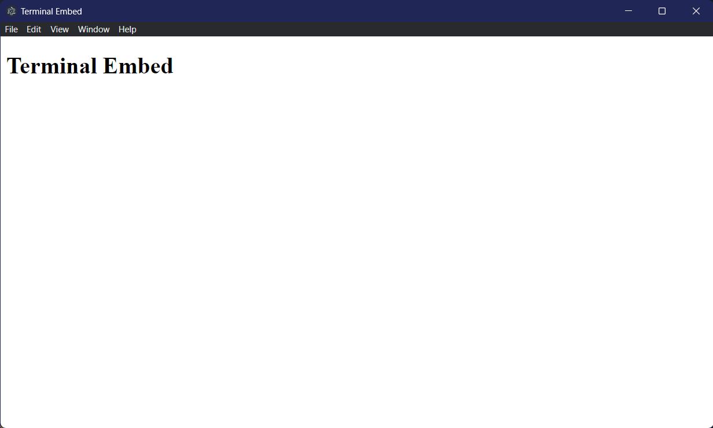
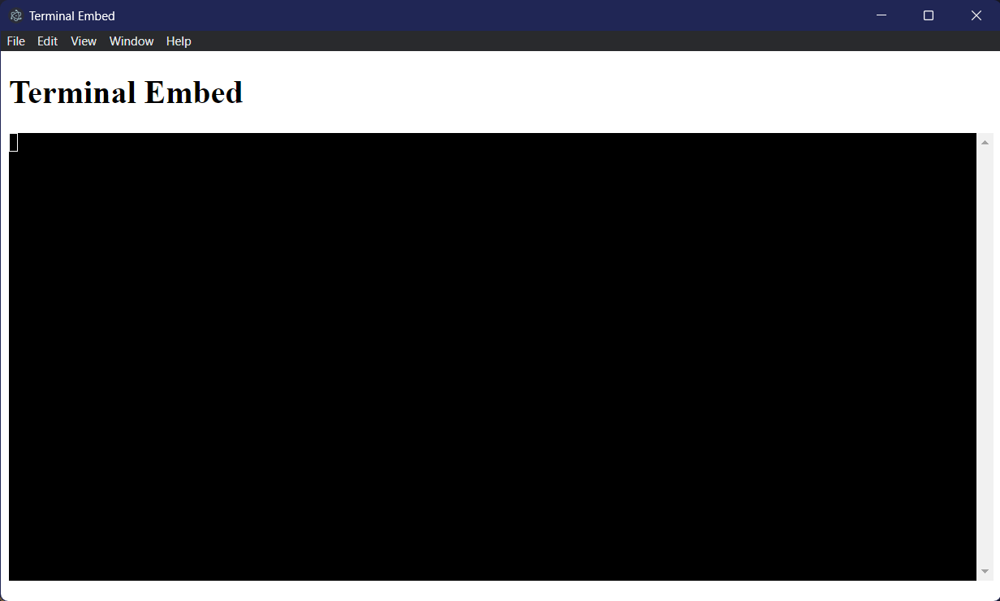
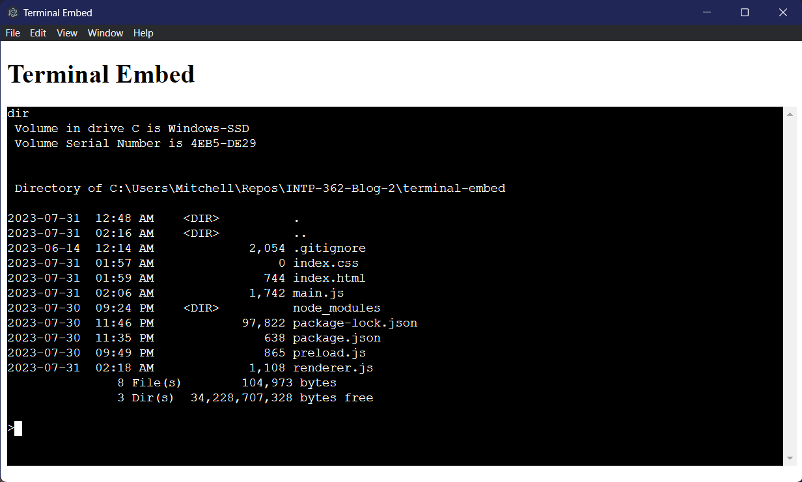
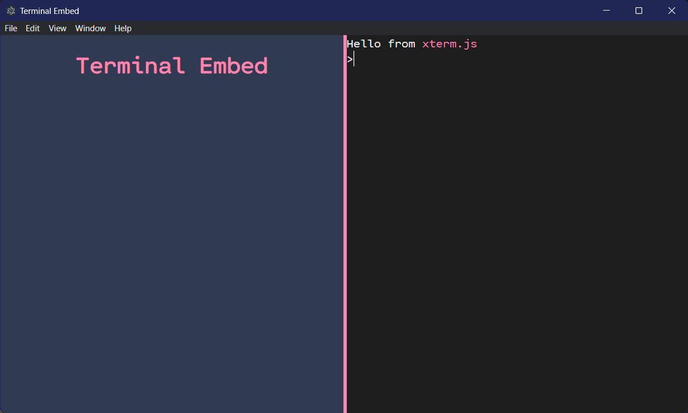

# The Electron App Development Cycle


In my last post, I covered the basic concepts of Electron, why it has such a _divisive_ reputation, why you would choose it, and how to get started with it. As with basically any framework, it can be really difficult to grasp the concepts until you've actually built something with it. This time, I'll be walking through the development cycle of the start of a project.

## The Project

I'm going to be walking through the process of creating a small portion of a personal project I've been working on. We'll be creating an Electron app with an integrated, usable terminal. This will be done with the help of [**xterm.js**](https://xtermjs.org/), and [**node-pty**](https://github.com/microsoft/node-pty). For the front-end, we won't be using any frameworks, just plain old HTML, CSS, and JavaScript, for simplicity's sake.

### Alright, what do they do?

#### **`xterm.js`**

- **xterm.js** is a front-end component that provides a terminal emulator for web apps, we'll use it to render the terminal in our Electron app.

#### **`node-pty`**

- **node-pty** is a module that provides a pseudo-terminal interface for Node.js, we'll use it to create a shell session for the terminal emulator to interact with. Which essentially means that it will give us proper read and write functionality for the terminal to properly interact with our computer.

## Where to start

I touched on the setup a little bit in my last post, but ultimately, your best bet is to read the official [Electron Quick Start Guide](https://www.electronjs.org/docs/tutorial/quick-start). What I _will_ do is quickly go over installing the dependencies we'll need for this project, and setting up the file structure of the project.

### Installing Dependencies

Assuming you have a basic Electron project set up, we essentially just need to install **node-pty**, **xterm.js**, and any xterm addons we want to use. The terminal should be open in the root directory of your project, and we'll run the following command:

```bash
npm install node-pty xterm xterm-addon-fit xterm-addon-web-links xterm-addon-search
```

This will install all of the dependencies we need for this project. You can check that they were installed by looking at the `package.json` file in the root directory of your project. You should see something similar to this:

#### **`package.json`**

```json
{
  "dependencies": {
    "node-pty": "^1.0.0",
    "xterm": "^5.2.1",
    "xterm-addon-fit": "^0.7.0",
    "xterm-addon-search": "^0.12.0",
    "xterm-addon-web-links": "^0.8.0"
  }
}
```

### Project Structure

The project structure is pretty simple. We’ll need an `index.html` file to display the terminal, a `main.js` file to set up the Electron app and spawn the pty process, a `renderer.js` file to render and configure the terminal, and a `preload.js` file to expose methods for communication between the renderer process and the main process. Everything can just be kept in the root directory of the project to keep things simple.

## Setting up the Electron App

Now that we have the basic structure of the project set up, we can start working on the Electron app itself. We’ll start by setting up the `main.js` file. We'll start by creating a `BrowserWindow` that displays our `index.html` file. We’ll also specify our `preload.js` script as the preload script for the window’s web preferences:

#### **`main.js`**

```javascript
// Import the app and BrowserWindow modules from Electron
// Also import the path module to handle file paths
const { app, BrowserWindow } = require("electron");
const path = require("path");

let win;

// Create the browser window.
// The preload script is specified here.
function createWindow() {
  win = new BrowserWindow({
    width: 1000,
    height: 600,
    webPreferences: {
      preload: path.join(__dirname, "preload.js"),
    },
  });

  // Load the index.html file
  win.loadFile("index.html");
}

// Create the window when the app is ready
app.whenReady().then(() => {
  // Create the window
  createWindow();

  // Create a new window if there are no windows when the app is activated
  app.on("activate", () => {
    if (BrowserWindow.getAllWindows().length === 0) {
      createWindow();
    }
  });

  // Quit the app when all windows are closed (except on macOS)
  app.on("window-all-closed", () => {
    if (process.platform !== "darwin") {
      app.quit();
    }
  });
});
```

#### **`index.html`**

```html
<!DOCTYPE html>
<html lang="en">
  <head>
    <meta charset="UTF-8" />
    <meta name="viewport" content="width=device-width, initial-scale=1.0" />
    <title>Terminal Embed</title>
  </head>
  <body>
    <h1>Terminal Embed</h1>
  </body>
</html>
```

All this does is create a window that displays our `index.html` file, and sets up some event listeners for when the window is closed, the app is activated, and all windows are closed for now, but we'll be back.

### **`Result`**



## Setting up Communication between Processes

If we want to communicate between the renderer process (where our terminal is displayed) and the main process (where our pty process is spawned), we’ll need to set up some methods for sending and receiving data.

In our `preload.js` script, we’ll use the `contextBridge` module from Electron to expose some methods in the main world of the renderer process. These methods will allow us to send data from the renderer process to the main process using IPC (refer to my [last post](https://mitchellv3.github.io/INTP-362-Blog) for more information on IPC). We’ll also use the `ipcRenderer` module from Electron to listen for data from the main process, and invoke the methods we exposed in the main world of the renderer process.

#### **`preload.js`**

```javascript
/*
 * This script uses the contextBridge and ipcRenderer modules from the electron package to expose a terminal object in the main world of the renderer process.
 * The terminal object has two methods: toTerm and incData.
 */
const { contextBridge, ipcRenderer } = require("electron");

contextBridge.exposeInMainWorld("terminal", {
  // This method sends data from the renderer process to the main process using the ipcRenderer.invoke method.
  // The data is sent with the channel "terminal.toTerm".
  toTerm: (data) => ipcRenderer.invoke("terminal.toTerm", data),

  // This method listens for incoming data from the main process on the "terminal.incData" channel using the ipcRenderer.on method.
  // The provided callback function is called whenever data is received.
  incData: (callback) => ipcRenderer.on("terminal.incData", callback),
});
```

### This probably looks a little confusing, but it’s actually pretty simple

We’re just exposing two methods to the renderer process.

- The `toTerm` method sends data from the renderer process to the main process using the `ipcRenderer.invoke` method.

- The `incData` method listens for incoming data from the main process on the `terminal.incData` channel using the `ipcRenderer.on` method, and invokes the provided callback function whenever data is received.

We’ll use these methods to send data from the renderer process to the main process, and receive data from the main process in the renderer process. We’ll see how this works in a bit.

Now let's go back to our `main.js` file.

We need a way to handle any data being sent from the renderer process to the main process, and send any data from the main process to the renderer process. We’ll do this by creating a `ptyProcess` object that will spawn a shell session using the `node-pty` module, and handle any data being sent to and from the shell session.

We’ll set up an event handler for incoming data from the renderer process using the `ipcMain.handle` method. We’ll also set up a pty process using `pty.spawn` and attach an event listener for incoming data from the pty process. The data will be sent to the renderer process using the `win.webContents.send` method:

#### **`main.js`**

```javascript
const { app, BrowserWindow, ipcMain } = require("electron");
const path = require("path");
const os = require("os");
const pty = require("node-pty");

// Set the shell depending on the OS
const shell = os.platform() === "win32" ? "cmd.exe" : "bash";
let ptyProcess;
let win;

// Create the browser window.
function createWindow() {
  // ...
}

// Create the window when the app is ready
app.whenReady().then(() => {
  // Create the window
  createWindow();

  // Spawn a new pty process with the specified shell and options
  ptyProcess = pty.spawn(shell, ["/K", "prompt $G"], {
    name: "xterm-color",
    cwd: process.cwd(),
    env: process.env,
  });

  // Attach the onData event handler after the pty process is created
  // Send incoming data from the pty process to the renderer process
  ptyProcess.onData((data) => {
    win.webContents.send("terminal.incData", data);
  });

  // Handle incoming data from the renderer process
  // Write the data to the pty process
  ipcMain.handle("terminal.toTerm", (event, data) => {
    ptyProcess.write(data);
  });

  // Create a new window if there are no windows when the app is activated
  app.on("activate", () => {
    if (BrowserWindow.getAllWindows().length === 0) {
      createWindow();
    }
  });

  // Quit the app when all windows are closed (except on macOS)
  app.on("window-all-closed", () => {
    if (process.platform !== "darwin") {
      app.quit();
    }
  });
});
```

### Let's break this down a little bit

- We set the shell depending on the OS using the `os.platform` method. Windows uses `cmd`, and everything else uses `bash`.

- We’re creating a `ptyProcess` object that will spawn the specified shell, and handle any data being sent to and from the shell session.

  - We're passing two arguments to the `pty.spawn` method: the shell to be spawned, and an array of arguments to be passed directly to the shell. We're also specifying the name of the terminal (`xterm-color` is the default), the current working directory, and the environment variables.

  - The `/K` shell argument simply removes the copyright information that is displayed when the shell is opened, and the `prompt $G` argument sets the prompt to not display the current directory before the `>` prompt.

- We’re attaching an event listener for incoming data from the pty process using the `onData` method. The data is sent to the renderer process using the `win.webContents.send` method.

- We’re setting up an event handler for incoming data from the renderer process using the `ipcMain.handle` method. The data is written to the pty process using the `ptyProcess.write` method.

Now that we have the basic setup for the Electron app, and processes communicating with each other, we can finally implement the terminal itself.

## Setting up the Terminal

We'll start by setting up the `index.html` file. We'll add a `div` element with the ID `"terminal"` to the body of the document. We'll also add a `script` element that loads our `renderer.js` script, and import the `xterm.css` file from the `xterm` module. Since Electron limits our ability to import directly into the renderer process, we'll also need to import **xterm.js** itself and any addon scripts directly into the HTML file:

#### **`index.html`**

```html
<!DOCTYPE html>
<html lang="en">
  <head>
    <meta charset="UTF-8" />
    <meta name="viewport" content="width=device-width, initial-scale=1.0" />
    <link rel="stylesheet" href="node_modules/xterm/css/xterm.css" />
    <title>Terminal Embed</title>
  </head>
  <body>
    <h1>Terminal Embed</h1>

    <div class="terminal" id="terminal"></div>

    <script src="node_modules/xterm/lib/xterm.js"></script>
    <script src="node_modules/xterm-addon-fit/lib/xterm-addon-fit.js"></script>
    <script src="node_modules/xterm-addon-web-links/lib/xterm-addon-web-links.js"></script>
    <script src="node_modules/xterm-addon-search/lib/xterm-addon-search.js"></script>
    <script src="renderer.js"></script>
  </body>
</html>
```

In our `renderer.js` script, we’ll create a new instance of the Terminal class with the specified options and open it in the HTML element with the ID `"terminal"` that we created in the `index.html` file. We’ll also add the `fit` addon to the terminal to automatically resize the terminal to fit the size of the window, and the `webLinks` and `search` addons to enable web links and search functionality:

#### **`renderer.js`**

```javascript
// Creates a new instance of the Terminal class from xterm.js
const term = new Terminal();

// Set up the terminal addons and load them.
const fitAddon = new FitAddon.FitAddon();
term.loadAddon(fitAddon);

const searchAddon = new SearchAddon.SearchAddon();
term.loadAddon(searchAddon);

const webLinksAddon = new WebLinksAddon.WebLinksAddon();
term.loadAddon(webLinksAddon);

// Opens the terminal in the HTML element with the ID "terminal".
term.open(document.getElementById("terminal"));

// Fits the terminal to the size of the window.
fitAddon.fit();
```

We're almost there! The terminal is rendering properly, but you aren't able to input anything.

### **`Result`**



### Last step

We’ll set up event listeners to take incoming data from the main process using the `terminal.incData` method exposed by our preload script. The data will be written to the terminal using the `term.write` method. We’ll also listen for data entered into the terminal by the user with the `term.onData` event and send it to the main process using the `terminal.toTerm` method exposed by our preload script:

#### **`renderer.js`**

```javascript
// ...

// Listens for data entered into the terminal by the user using the term.onData event and sends it to the main process.
// Sends the data to the main process using the terminal.toTerm method exposed by the preload script
term.onData((data) => {
  terminal.toTerm(data);
});

// Event listeners for incoming data from the main process using the terminal.incData method exposed by the preload script
// Writes the data to the terminal using the term.write method.
terminal.incData((event, data) => {
  term.write(data);
});
```

Great! Now we have a fully functional terminal embedded in our Electron app. You can try it out by running the following command in the terminal:

```bash
dir
```

You should see the contents of the current directory displayed.

### **`Result`**



### Finally, Let's add a little bit of styling

This is only a small portion of a larger project, so I won't be going too in-depth with the styling. I'll just be adding a little bit to make the terminal and app window look a little nicer.

#### **`index.html`**

```html
<!DOCTYPE html>
<html lang="en">
  <head>
    <meta charset="UTF-8" />
    <meta name="viewport" content="width=device-width, initial-scale=1.0" />
    <link rel="stylesheet" href="node_modules/xterm/css/xterm.css" />
    <link rel="stylesheet" href="index.css" />

    <title>Terminal Embed</title>
  </head>
  <body>
    <div class="container">
      <div class="left-container">
        <h1>Terminal Embed</h1>
      </div>

      <div class="right-container">
        <div class="terminal" id="terminal"></div>
      </div>
    </div>

    <script src="node_modules/xterm/lib/xterm.js"></script>
    <script src="node_modules/xterm-addon-fit/lib/xterm-addon-fit.js"></script>
    <script src="node_modules/xterm-addon-web-links/lib/xterm-addon-web-links.js"></script>
    <script src="node_modules/xterm-addon-search/lib/xterm-addon-search.js"></script>
    <script src="renderer.js"></script>
  </body>
</html>
```

#### **`index.css`**

```css
body {
  background-color: #303a52;
  color: #e4e4e4;
  font-family: "Cartograph CF Light", Consolas, "Courier New", monospace,
    sans-serif;
  margin: 0;
  padding: 0;
}

.container {
  display: flex;
  flex-direction: row;
  height: 100vh;
  width: 100vw;
  margin: 0;
}

.left-container {
  display: flex;
  flex-direction: column;
  align-items: center;
  width: 50%;
  height: 100%;
  margin: 0;
  border-right: 3px solid #fc85ae;
}

.right-container {
  display: flex;
  flex-direction: column;
  width: 50%;
  height: 100%;
  margin: 0;
  border-left: 3px solid #fc85ae;
}

h1 {
  color: #fc85ae;
  margin: 0;
  padding: 20px;
  text-align: center;
}

.terminal {
  height: 100%;
  width: 100%;
}

.xterm-viewport::-webkit-scrollbar {
  width: 8px;
}

.xterm-viewport::-webkit-scrollbar-thumb {
  background-color: rgba(0, 0, 0, 0.5);
  border-radius: 4px;
}
```

#### **`renderer.js`**

```javascript
// Creates a new instance of the Terminal class from xterm.js with the specified options.
const term = new Terminal({
  rightClickSelectsWord: true,
  fontSize: 16,
  fontFamily: "'Cartograph CF Light', Consolas, 'Courier New', monospace",
  theme: {
    background: "#1e1e1e",
  },
  experimentalCharAtlas: "dynamic",
  cursorStyle: "bar",
  cursorBlink: true,
});

// ...

// Prints the given text to the terminal.
// \x1B[38;2;252;133;174m is the color pink. \x1B[0m resets the color.
// \n\r is a new line and returns the cursor to the start of the line.
term.write("Hello from \x1B[38;2;252;133;174mxterm.js\x1B[0m \n\r");
term.write(">");

// ...
```

### **`Result`**



## And that's it

You can wipe the sweat away and relax from trying to take in all of that information. I hope you gained a deeper understanding of how the key concepts of Electron work, and how they're implemented in a real project.

If you would like to see the full project, the source code can be found by clicking the link on the left.
