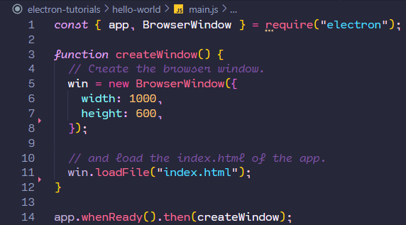
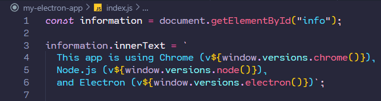
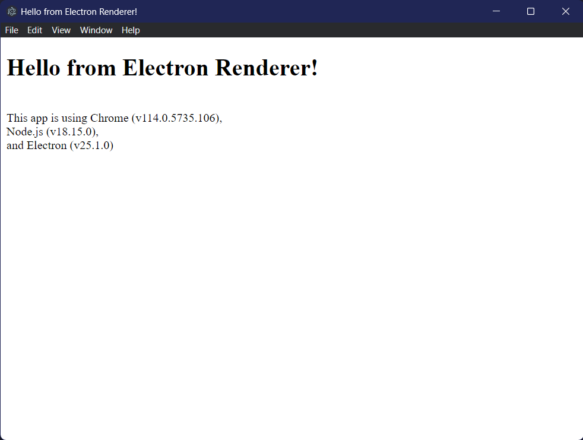

# The Electron Framework and How it Makes Cross-Platform Development Easy

## Electron?

Electron is a framework that allows developers to create cross-platform desktop applications using JavaScript, HTML, and CSS. It is the main GUI framework behind many notable apps such as Atom, GitHub Desktop, Discord, Visual Studio Code, Slack, and Skype.  
To say Electron is _infamous_ would be an understatement. The framework is known as the technology that developers **love** and users **hate**.

## But why?

Well, Electron is _familiar_. Instead of having to learn a new language or framework, developers can use the same languages they already know and love for web development. Obviously, this makes it easy to get started with. But this familiarity comes at a cost. Electron is a **resource hog**. It is a well-known fact that Electron apps are bloated and _hungry_ for your computer's resources. This is because Electron apps are essentially web apps running in a Chromium browser. This means that every Electron app has its own Chromium instance running in the background. And its no secret that Chromium isn't exactly the most lightweight thing out there.

So why do developers still use Electron? Simple. Electron makes things _easy_. Easy to develop for, and easy to deploy. Electron allows you to maintain one JavaScript codebase and create apps that work on Windows, Mac, and Linux - no native development experience required. It also allows you to leverage the entire node.js ecosystem, and any other library and framework for these long-established languages.  
Want to create a desktop app using React? No problem. Want to use Angular? Go ahead. Want to use Vue? Sure. What about an app using Bootstrap, Sass, TypeScript, and React together? Obviously. It's a true blank slate.

This is a huge advantage for developers who don't want to learn a new language or framework for every platform.

## Okay, but how does it work?

One of the core concepts of Electron is that it is made up of two processes: the **main process** and **renderer processes**.

### Main Process

- The main process is responsible for running the app's main script specified in the `package.json` file, and allows the app to access native operating system resources. In addition, is also responsible for managing the entire lifecycle of the application.

### Renderer Processes

- The renderer processes are responsible for displaying the web pages in the app's windows. Each window has its own renderer process and is able to access web technologies.

The main and renderer processes are isolated from each other and run in separate contexts. This means that the main process is able to access Node.js APIs, while the renderer processes are able to access Chromium APIs. This is important for security reasons because it prevents the renderer processes (aka: the web pages) from accessing the operating system directly.

### So how do they communicate?

That's where another core concept of Electron comes in: **inter-process communication** or **IPC** and **preload scripts**.

So we have the main process with full operating system access, and the renderer processes with full web technology access. Obviously, we want to be able to communicate information between the two.

### Preload Scripts

- Electron is able to expose features to the renderer that require privileged access using a unique script called a **preload script**. The preload is injected into the renderer process before any other scripts run. This allows the preload script to have access to Node.js APIs, and then expose them to the renderer process via the `contextBridge` API.

### IPC

- The main and renderer processes can communicate with each other using the `ipcMain` and `ipcRenderer` modules. The `ipcMain` module handles messages sent from the renderer processes to the main process, and the `ipcRenderer` module handles messages sent from the main process to the renderer processes.

### Okay, that was a lot.

The concepts of Electron can be a bit confusing at first, but the best way to understand them is to see them in action. So let's get started with some simple examples.

## So, let's get started

I won't go into too much detail about the setup process, as it is pretty straightforward. You can find the official Electron quick start guide [here](https://www.electronjs.org/docs/tutorial/quick-start).

The only requirement is that you have Node.js installed. Electron isn't actually something you install globally, but rather something you install locally in your project. Electron is a project dependency, not a tool you use to build your project.

Electron projects are built by initializing an npm package using the `npm init` command, and then installing Electron as a dependency. Scaffolding an npm project will prompt you to enter some information about your project, such as the name, version, description, etc. You can just press enter to accept the default values. The only recommended change is to set the entry point to `main.js` instead of `index.js`. As a convention, Electron apps use `main.js` as the entry point and `index.js` as the renderer process for the index.html window.

Once the project initialized, you can install Electron as a dependency using the `npm i --save-dev electron` command. This will install the latest version of Electron into the app's `devDependencies`.

Electron is installed as a `devDependency` because it is only used during development. When the app is packaged for production, Electron is bundled into the app and is no longer a dependency.

### Almost there

Now that the npm project is initialized and Electron is installed, all we need to do is edit the `package.json` file to add tell the application that Electron will look for the main process and run it in development mode.

To do this, we need to add the following to the `scripts` section of the `package.json` file:

**`"start": "electron .",`**

### Like so:

```json
{
  "name": "my-electron-app",
  "version": "1.0.0",
  "description": "Hello World!",
  "main": "main.js",
  "scripts": {
    "start": "electron .",
    "test": "echo \"Error: no test specified\" && exit 1"
  },
  "author": "Jane Doe",
  "license": "MIT",
  "devDependencies": {
    "electron": "23.1.3"
  }
}
```

Now, when we run the `npm start` command, Electron will look for the `main.js` file and run it.

## What now?

Well, you might remember that I mentioned that Electron apps are essentially web apps running in a Chromium browser. So, let's start with a simple HTML file.

You can just use regular boilerplate code for now. Just add a tag with some text in it.

```html
<html>
  <head>
    <title>Hello</title>
  </head>
  <body>
    <h1>Hello from Electron Renderer!</h1>
  </body>
</html>
```

Now, let's create a `main.js` file in the root of the project. This will be the main process for the app.

We can load the HTML file using Electron's `BrowserWindow` and its `loadFile` method. This method takes a path to an HTML file and loads it into the window. Then, we can call the window creation method in the `app.whenReady()` method. This method is called when Electron has finished initializing and is ready to create browser windows.



Now, when we run the `npm start` command, Electron will create a window and load the HTML file into it, we should see our greeting displayed in the window, the same way a web page would.

I won't go into too much detail about the common main process boilerplate code, like ensuring that the app is only running one instance at a time, or handling the app's lifecycle events. You can find more information about that [here](https://www.electronjs.org/docs/tutorial/quick-start#create-the-main-script-file).

### So, what about the renderer process?

Well, we're going to create a **preload script** first. This will expose some OS methods to the renderer process to demonstrate how the two processes communicate.


Here we are exposing the `process.versions` object to the renderer process. This object contains the versions of Node.js, Chromium, and Electron. This would normally not be accessible to the renderer process, but we are exposing it using the `contextBridge` API.

Now we simply have to connect all the pieces together. We can start by adding our preload location to the main process.


Next we can finally create our renderer process. Just a script called `index.js` that will be loaded into the HTML file. It only needs two lines to retrieve the data from the main process and display it in the HTML file.



Last but not least, we need to add our renderer script to the HTML file, and create an element to display the data.

This is as simple as adding both a script tag and a paragraph tag.

```html
<html>
  <head>
    <title>Hello</title>
  </head>
  <body>
    <h1>Hello from Electron Renderer!</h1>
    <p id="info"></p>
  </body>
  <script src="./renderer.js"></script>
</html>
```

### And that's it!

Now, when we run the `npm start` command, Electron will create a window and load the HTML file into it. The renderer process will then retrieve the data from the preload and display it in the HTML file.



This was essentially a shortened version of the [Official Electron Tutorial](https://www.electronjs.org/docs/tutorial/tutorial-first-app). Check it out if you want to learn more about the basics of Electron.
